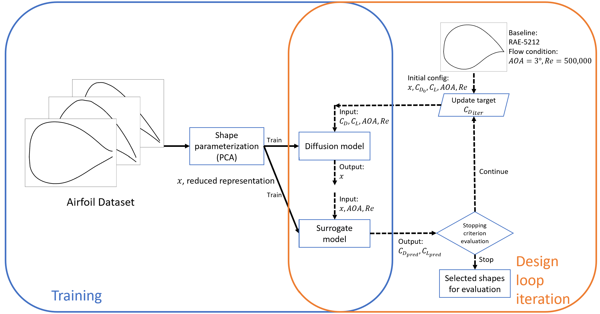
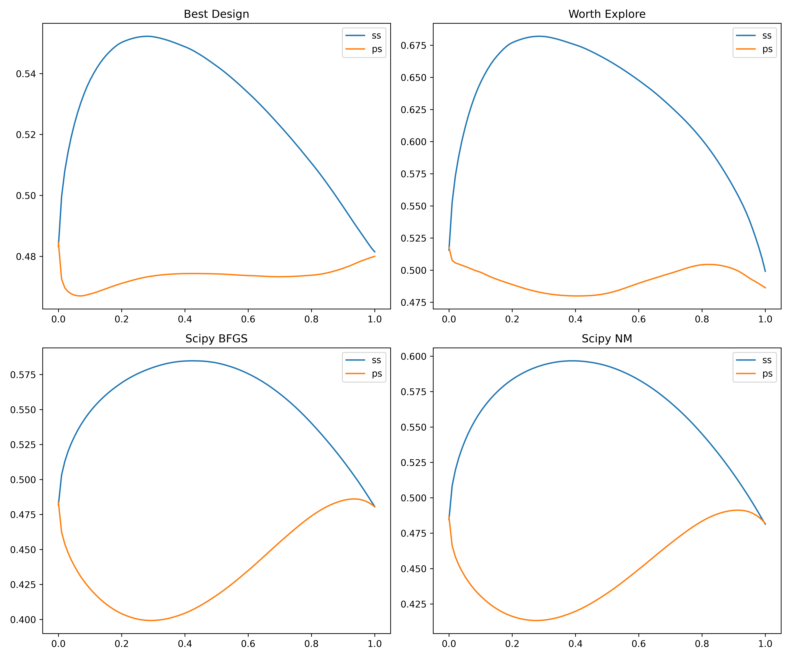
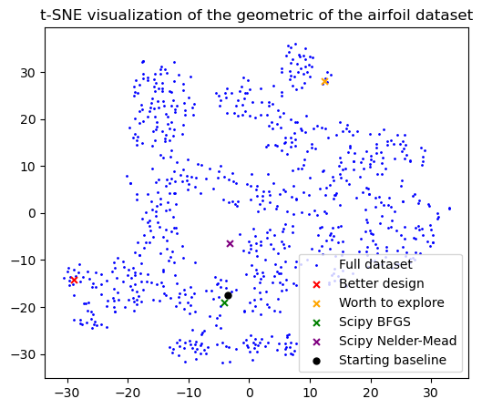

# Summary
This project explores the use of a conditioned generative model to generate realistic 2D airfoil samples for aerodynamic optimization. A neural network-based surrogate model is trained to evaluate the airfoils. PCA is used to encode the geometric representation of 2D airfoil to latent space.

The project demonstrates the model's ability to produce feasible solutions within specified lift coefficient thresholds, and the possibility of applying conditional generative models in optimization problems.

**Update Apr17, 2025**: See the project report at `project_report.pdf`.

---

### Intro

The diffusion model is based on the classifier-free guidance (CFG) by [Ho and Salimans](https://arxiv.org/abs/2207.12598) and the EDM framework by [Karras et al. 2022](https://arxiv.org/abs/2206.00364). Our approach incorporates flow conditions (angle of attack, Reynolds number) and design specifications (lift and drag coefficients) as parallel inputs with geometry information to compute scores during the diffusion process. These conditions serve as 'soft' constraints, guiding the model toward regions that satisfy or closely align with these specifications. Although it is possible to impose 'hard' geometric constraints (such as curvature and thickness) in the reverse process, this project relies on the diffusion model's inherent capabilities to generate feasible airfoil shapes. 

The presented method is similar to using GANs for generating initial guesses in airfoil design, as explored by [Li et al. 2020](https://arc.aiaa.org/doi/10.2514/1.J059254). However, our project proposes a unique design loop that derives an effective initial design from a selected baseline airfoil, forming the foundation for an experiment-driven approach to optimize airfoil shapes.

The dataset is extracted from the [unprocessed dataset (airfoil learning)](https://github.com/nasa/airfoil-learning). The processed dataset and the scalers are stored under `pickle_files`.

---

### Workflow


PCA is employed to extract smooth geometric representations of airfoils in the dataset. The diffusion model learns the distribution of parameterized airfoils and their correlations to flow conditions, specifically Re and AOA. Unlike [Li et al. 2020](https://arc.aiaa.org/doi/10.2514/1.J059254), where a discriminator scores the generated airfoils, we train a surrogate model to predict the lift and drag coefficients of the generated shapes. Starting from the flow conditions of the selected baseline airfoil (RAE-5212), we gradually decrease the drag coefficient. The stopping criterion is based on the alignment of lift and drag coefficients within the ensemble of generated airfoils.

---

### Generated 2D airfoils




The generated airfoils from the optimization and the t-SNE plots are shown above. The better design denotes the airfoil that gives the best result within the specified range, the worth explore denotes the best result without limiting the range (typically out of the captured distribution).

| Design                        | Xfoil - $C_D$ | Xfoil - $C_L$ | Surrogate Model - $C_D$ | Surrogate Model  $C_L$ |
|-------------------------------|------------------------|-------------------------|----------------------------------|---------------------------------|
| Best Design                   | **0.007467**               | 0.584854                | 0.004928                         | **0.563003**                        |
| Design Worth Exploring        | 0.018295               | **0.703991**               | **-0.007866**                        | 0.546417                        |
| BFGS                  | 0.008282               | 0.614409                | 0.005388                         | 0.531975                        |
| Nelder-Mead       | None                   | None                    | -0.000226                        | 0.710151                        |

* Drag coefficient, $C_D$, the lower the better.
* Lift coefficient, $C_L$, the higher the better.
* Baseline $C_D$ = 0.01086, $C_L$ = 0.56230

The optimization is included in the `demo.ipynb` notebook.

[Xfoil](https://web.mit.edu/drela/Public/web/xfoil/) is used as a verification tool to evaluate the generated airfoils. The Nelder-Mead failed to converge, due to the overlapping at the tail of the airfoil. The close loop design loop demonstrates that it can produce a feasible solution while satisfying the threshold set on the lift coefficients, however, we found that hyper parameter tuning is required for generating physical airfoils. It should be noted that it can be solved by implementing shape constraint in the reverse process of solving the PF ODE

---

### Surrogate Model


Performance of the surrogate model, $C_D$ (Train) RMSE: 7.547E-3, $C_D$ (Validation) RMSE: 8.74E-4; $C_L$ (Train) RMSE: 6.478E-2, $C_L$ (Validation) RMSE: 7.77E-3.

---

### Required packages
- pytorch
- tensorboard (for training)
- pandas
- scikit-learn

---

### Training
Surrogate model training:
```
python -m models.airfoil_surrogate
```
Diffusion model training:
```
python -m models.airfoil_MLP 
```

---

### Data preprocessing
If you wish to use your own parsed dataset (following the instruction in the [airfoil-learning repository](https://github.com/nasa/airfoil-learning)), you can put the json files under the directory 'airfoil-learning-dataset' and run the following command to preprocess the dataset:
```
python preprocess.py
```

---

### Code Contributors
- Yilin Zhuang, Git: [tonyzyl](https://github.com/tonyzyl)
- Amirpasha Kamalhedayat, Git: [APHedayat](https://github.com/APHedayat)
- Christian Jacobsen, Git: [christian-jacobsen ](https://github.com/christian-jacobsen)